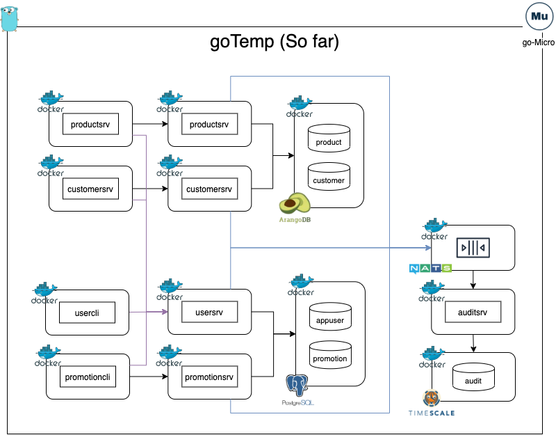

# goTemp

goTemp is an introduction to Golang microservices using go-micro.

In it current incarnation (this is wip), this mono-repo uses the following stack:

- `Golang` as its main implementation technology
- `go-Micro` as the micro service framework
- `gRPC` for inter-service real time communication
- `NATS` for Pub/Sub event driven communication
- `multicast DNS`: for service registration and discovery 
- `PostgreSql` for transactional data storage
- `TimescaleDB` time series DB for historical audit data storage
- `ArangoDB` Multi-model database for master data storage
- `Docker` for creating application images
- `Docker-compose` to run the services

Below is a diagram that displays the overall setup of the application:

In a nutshell. the application functionality is as follows:

- Each service perform the basic CRUD operations to their underlying databases
- All services authenticate via the user service
- All CUD operations are forwarded to the NATS broker which in turn forwards the message to the auditing service. This service saves the data into TimescaleDB

#### Repo organization

The project is organized in a way that each folder represents either a service, a database or a shared library package.
Currently, we have the following:

- `arangodb`: Volumes mounted to the ArangoDB container as well as data initialization scripts
- `audit`: Audit service to collect and store historical audit information
- `customer`: Customer master data service
- `globalErrors`: Generic errors shared package
- `globalProtos`: Generic protobuf message definitions shared across packages
- `globalUtils`: Generic utilities shared package
- `nats`: NATS dockerfile and configuration
- `postgres`: Volumes mounted to the PostgreSQL DB container as well as data initialization scripts
- `promotion`: Promotion service to track product discounts (this is the first service that was built)
- `timescaleDB`: Volumes mounted to the Timescale DB container as well as data initialization scripts
- `user`: User and authentication service

Additionally, we have the following files in the root directory as well:

- `.dockerignore`: Files to be ignored when building service images
- `.gitignore`: Files to be ignored by git
- `docker-compose`: Compose file that controls the building of the different services and their dependencies
- `go.mod and go.sum`: Go modules control
- `main.go`: Not used for service yet
- `Makefile`: shortcuts to common actions
- `Readme.md`: Well... this file...

#### Services

##### Organization

Each one of the services has a similar structure:

- `client`: Contains a client service that calls the server service to perform multiple operations
- `proto`: Proto buffer messages and services definitions. Empty if service does not handle real time inter-service communication.
- `server`: Service that performs a number of actions like interacting with the DB
- `Dockerfile`: Build the image for the server service
- `DockerfileCLI`: Build the image of the client service
- `docker-compose.env`: Environment variable required to run the service when running the service with docker-compose
- `docker-compose-cli.env`: Environment variable required to run the client when running the client with docker-compose

##### Building

The different service's images can be built from the root of the repo using the docker build command. 
For example the user service can be built using:

`docker build -t usersrv -f user/Dockerfile . `

Note that there is no need to run this if you are using docker-compose as that will build the image automatically

##### Running

The services are designed to run in containers, and the easiest way to run them is to bring them up using docker-compose:
As an example we will run the user service with the commands below in a terminal:

`docker-compose up usersrv`

This will bring up the user service, the postgreSQL DB and NATS
Then to run some data through the service, we can start the user client in a new terminal:

`docker-compose up usercli`

This will bring up run the client service which will attempt to create,update and delete a user. The results will be printed in the console.
The server user service will update the DB as necessary and send the updated information to the broker (NATS) so that the 
the audit service may eventually store it in the time series DB. The audit service can be started using:

`docker-compose up auditsrv`

#### Databases Initialization

The project initializes each of the DBs and seeds them with tables and data. THe data persists over time so that the containers
can be brought up and down as needed when running docker-compose as long as the associated volume mounts are not deleted. 
See the folders for each DB for details as well as the dockre-compose file.

#### Additional information:

Additional information can be found in the individual folders either in a `readme.md` or a `doc.go` file.
