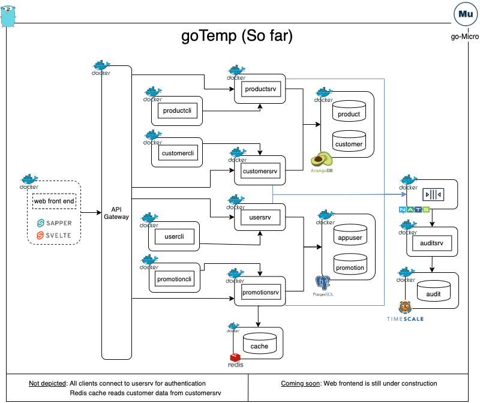

# goTemp

goTemp is an introduction to Golang microservices using go-micro.

In it current incarnation (this is wip), this mono-repo uses the following stack as backend:

- `Golang` as its main implementation technology
- `go-Micro` as the micro service framework
- `gRPC` for inter-service real time communication
- `NATS` for Pub/Sub event driven communication
- `multicast DNS`: for service registration and discovery 
- `PostgreSql` for transactional data storage
- `TimescaleDB` time series DB used for historical audit data storage
- `ArangoDB`is a multi-model database used for master data storage
- `Redis` is used to cache data and reduce number of data requests to other services
- `Docker` for creating application images
- `Docker-compose` to run the services

In terms of the web front end, the stack is as follows:

- `Javascript` as its main implementation technology
- `Svelte` is used as  the compilation engine (via rollup)
- `Sapper` is the javascript framework
- `Sveltestrap` provides the css framework and is based on bootstrap

Below is a diagram that displays the overall setup of the application:



In a nutshell. the application functionality is as follows in the backend:

- Each service perform the basic CRUD operations to their underlying databases
- All services authenticate via the user service
- All completed CUD operations are forwarded to the NATS broker which in turn forwards the message to the auditing service. This service saves the data into TimescaleDB
- Each service has a client which can be used to test all basic CRUD functionality

The frontend is still under construction at this time, but it is at a very usable state.

### Starting the application

- Clone the repository. Then, cd into `gotemp/web/sapper` and run `npm install` to generate the javascript dependencies.

- Before starting the application, ensure that Docker is installed and running. Then, run the following command from a terminal:

```bash
   make start
```

Depending on wether you have run the application before, docker may have to download all the dependent images (PostgerSql, TimescaleDB, Nodejs, etc).
Once everything has been downloaded and started, you should see a message in the terminal indicating that the application is listening at localhost:3000.
Open your browser and navigate to `http://localhost:3000`

#### Repo organization

The project is organized in a way that each folder represents either a service, a database or a shared library package.
Currently, we have the following:

- `arangodb`: Volumes mounted to the ArangoDB container as well as data initialization scripts
- `audit`: Audit service to collect and store historical audit information
- `customer`: Customer master data service
- `diagramforDocs`: Diagrams used in the readme documents
- `globalErrors`: Generic errors shared package
- `globalProtos`: Generic protobuf message definitions shared across packages
- `globalUtils`: Generic utilities shared package
- `nats`: NATS dockerfile and configuration
- `postgres`: Volumes mounted to the PostgreSQL DB container as well as data initialization scripts
- `product`: Product master data service
- `promotion`: Promotion service to track product discounts (this is the first service that was built)
- `redis`: Volumes mounted on the redis container as well as config files (if any)
- `timescaleDB`: Volumes mounted to the Timescale DB container as well as data initialization scripts
- `user`: User and authentication service
- `web`: application web frontend

Additionally, we have the following files in the root directory as well:

- `.dockerignore`: Files to be ignored when building service images
- `.gitignore`: Files to be ignored by git
- `docker-compose`: Compose file that controls the building of the different services and their dependencies
- `docker-compose-test`: Override compose file that can be used to test different services with their dependencies
- `go.mod and go.sum`: Go modules control
- `main.go`: Not used for services yet
- `Makefile`: shortcuts to common actions
- `Readme.md`: Well... this file...

#### Services

##### Organization

Each one of the services has a similar structure:

- `client`: Contains a client service that calls the server service to perform multiple operations
- `proto`: Proto buffer messages and services definitions. Empty if service does not handle real time inter-service communication.
- `server`: Service that performs a number of actions like interacting with the DB
- `Dockerfile`: Build the image for the server service
- `DockerfileCLI`: Build the image of the client service
- `docker-compose.env`: Environment variable required to run the service when running the service with docker-compose
- `docker-compose-cli.env`: Environment variable required to run the client when running the client with docker-compose

##### Building

The different service's images can be built from the root of the repo using the docker build command. 
For example the user service can be built using:

`docker build -t usersrv -f user/Dockerfile . `

Note that there is no need to run this if you are using docker-compose as that will build the image automatically

##### Running individual services

The services are designed to run in containers, and the easiest way to run them is to bring them up using docker-compose:
As an example we will run the user service with the commands below in a terminal:

`docker-compose up usersrv`

This will bring up the user service, the postgreSQL DB and NATS
Then to run some data through the service, we can start the user client in a new terminal:

`docker-compose up usercli`

This will bring up run the client service which will attempt to create,update and delete a user. The results will be printed in the console.
The server user service will update the DB as necessary and send the updated information to the broker (NATS) so that the 
the audit service may eventually store it in the time series DB. The audit service can be started using:

`docker-compose up auditsrv`

#### Databases Initialization

The project initializes each of the DBs and seeds them with tables and data. Data changes made at run time are automatically persisted using mounted volumes when running via docker-compose. 
See the folders for each DB for details as well as the docker-compose file.

#### Web front end

Our web front end is built with Svelte and Sapper which have some interesting benefits:

- Server side initial rendering of our pages
- File based routing
- Smaller code base than other Javascript frameworks. Does more with less.
- Svelte translates the code to vanilla javascript. Thus, smaller application footprint than most frameworks
- Emphasis on component re-usability

##### Organization

The web application lives in the `./web` folder. Since `Sapper` and `Svelte` generate multiple files and folders, we will just discuss the relevant folders below:

- `sapper`: The main folder containing the web app
    - `src`: This is where the bulk of the application resides
        - `components`: Contains re-usable `Svelte` components
        - `globalUtils`: Shared javascript utilities
        - `routes`: application routes to the different pages
        - `client.js`: Required file used to start `Sapper`
        - `server.js`: Used to configure app with items like middleware and compression
        - `template.html`: Main page that contains our application. We added Bootstrap and Fontawesome CDN references in this page
    - `static`: Holds static items
- `Dockerfile`: Used to build the docker image for the web app
        
#### Routes

All of our main routes are pretty standard in terms of organization. We will use the customer route (`./web/sapper/src/routes/customer`) as an example:

- `index.svelte`: Main customers search page that serves at localhost:3000/customer
- `_searchGridSlot`: Svelte component that holds the template for the search grid to be display in hte search page (index.svelte)
- `new.svelte`: Page to be displayed when user want to create a new customer. Displayed at localhost:3000/customer/new
- `[slug].svelte`: Page to view and modify existing customers. Displayed at localhost:3000/customer/[customerid]
- `_detail.svelte`: Holds the gui and bulk of the logic for adding or editing customers. It is called by new.svelte and [slug].svelte

There are three routes that do not share the structure above as they have very little functionality and thus are server by a single index.svelte component: root, register and login.


#### Additional information:

Additional information can be found in the individual folders either in a `readme.md` or a `doc.go` file.
Additionally, the Makefile contains many command samples that can be used for development.  