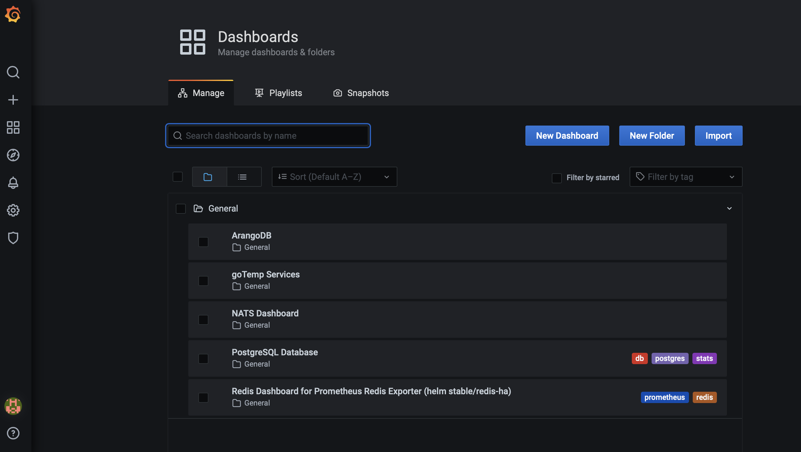
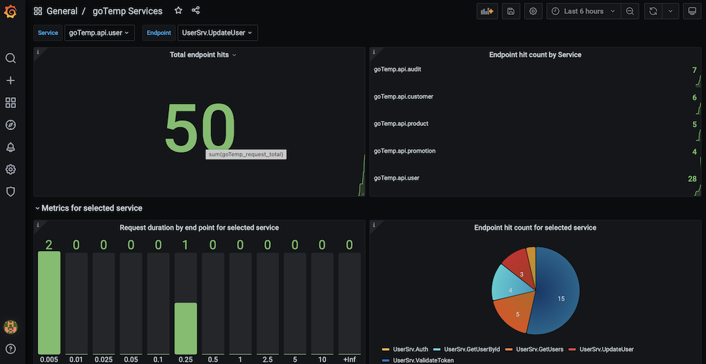
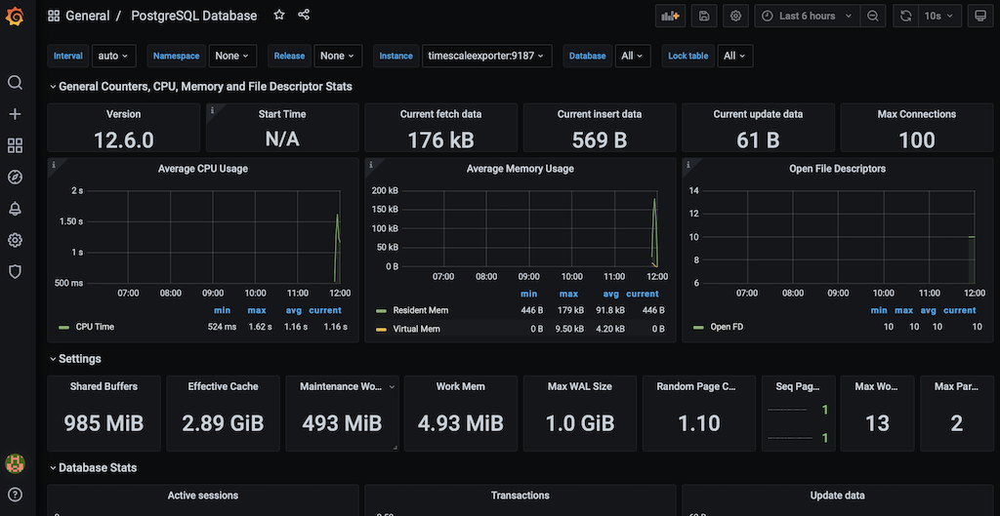

# Grafana integration

The application is integrated with Prometheus and Grafana to provide metrics observability.
Currently, it is set up to collect metrics from all services, databases and NATS.

The application comes with some dashboards out of the box. To access them go to `Dashboards -> Manage` in the menu structure

Below are two sample dashboards screenshots. The first one shows the microservices dashboards, while the second shows 
a standard postgreSQL dashboard.

### Folder Organization

This folder is organized as follows:

- `Provisioning`: Folder that contains Grafana configuration
  
    - `dashboards`: contains all the dashboards that will be available by default when system first comes up.
    - `datasources`: Definition of the data sources used by Grafana
    
- `docker-compose.env`: Environment variables required to run the service when running the Grafana with docker-compose