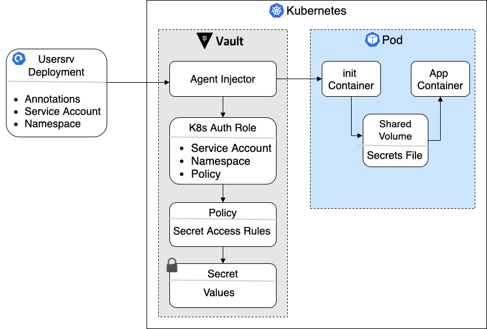
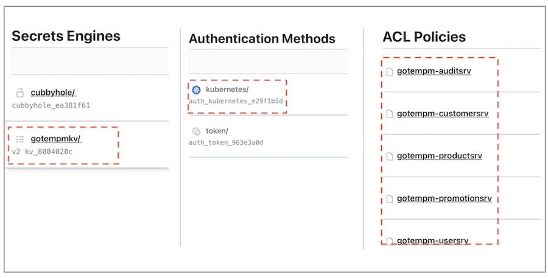
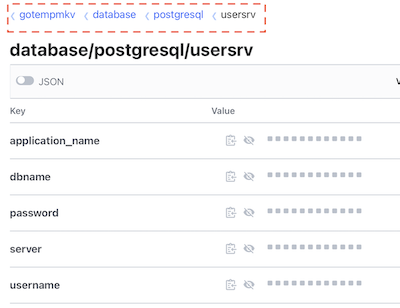

# Integrating services with Vault

The application services can be integrated with Vault when running in Kubernetes. The integration takes advantage of the Vault Agent Injector to create init containers that populate the necessary secrets in the services containers. 
This allows the integration to take place with no changes to the existing code base.

To enable the integration, there are two things that have to happen:
- Vault needs to be configured with the necessary secrets/policies/roles for our services
- The Kubernetes YAML manifests for our services deployments must be patched to interact with Vault's agent injector

The figure below shows how the Vault Injector will find and populate the secrets for the microservices




### Setting up Vault

#### Prerequisites

- Ensure [Helm](https://helm.sh/docs/intro/install/) is installed and that it has access to the K8s cluster 
- Install the [Vault Helm chart](https://www.vaultproject.io/docs/platform/k8s/helm/run#standalone-mode) in the cluster.
  The link contains instructions to install Vault in 'standalone' mode with a file storage backend. The Agent injector is installed alongside Vault by the Helm chart.
- Initialize and unseal Vault

#### Access the Vault UI (optional)

To access the Vault UI, set up a port forward to port 8200 in the Vault container:
```bash
  kubectl port-forward --namespace vault vault-0 8200:8200
```
If the port is busy or returns an error when trying to access the UI in localhost:8200,  try a different port like `8100:8200` or let the host assign the port using  `:8200`

#### Setup secrets in Vault

##### Scripts and policies

The current directory (`/vault`) is organized as follows:
- `policies` contains the policies that need to be created in Vault to provide access to our services' credentials
- `scripts` contains the scripts that create all the required secrets, policies and roles in Vault

##### Setup 

Note that the commands below assume that Vault was installed using the default name. Thus, it assumes that the Vault container is called `vault-0`. If that is not the case, you may need to modify the Makefile with the appropriate container name. 
Additionally, the scripts need a Vault token in order to authenticate properly. You may use your 
root token (not really recommended). Alternatively, you can create and provide your own token.

Initialize the Vault secrets engine and the Kubernetes authentication method by running:

```bash
    make vkubinit VAULT_TOKEN=<yourVaultToken>
```

Create the secrets and roles needed to populate the credentials for our services

```bash
    make vkubsetup VAULT_TOKEN=<yourVaultToken>
```

After everything runs successfully, the secrets, policies and authentication methods should hae been created in Vault.



### Patching the services' deployment manifests

The `/cicd/K8s/vault` directory contains the necessary manifests to patch our service deployments to set up interaction with Vault.

The folder has the following structure:

- `patch` contains the patches for each one of our service deployments.
- `serviceAccount` has the manifests that create the service accounts to be associated with our services.
- `testYamlFile` provides copies of the manifests for each of the services with the relevant secrets commented out. These manifests are used to test that the secrets are being properly populated by Vault. 

The service account and patches will be automatically applied when the application is started using:
```bash
    make vstartkub
```
However, they can also be applied separately by running:
```bash
    make vkubpatchdeploy
```

Once either of those commands completes, the microservices will be integrated with Vault. At this point, the credentials of the microservices can be managed centrally in Vault.

### Validating Integration

To validate that integration was successful after patching the deployments, you can check the following things:

- All microservices' pods are running
- Describe a service pod (kubectl describe) and ensure a Vault-agent-init was created and started
- Login into a service pod (kubectl exec) and check that there are files under /vault/secrets.
- The front end can pull and display data normally from the different microservices

### Testing the integration

We will test the integration for the user service, but a similar process can be done for any of the microservices:
- Login to PostgreSQL and ensure you are in the appuser DB
- Change the appuser database password

```postgresql
  ALTER USER postgres WITH PASSWORD '<yourSuperPWD>';
```

- In Vault, create a new version of the secret that keeps the postgresDB credentials for the user service (in the following secret engine: gotempmkv -> database -> postgresql -> usersrv).

  


- Ensure the new password in the new secret version matches the new password for the appuser DB
- Restart the rollout of the user service deployment

```bash
  kubectl rollout restart deployment usersrv
```
- In the web front end, try to log in to the application and pull some data for the user service

### Redeploying

One important aspect of this integration is that it does not change any of the existing code of YAML for the microservices by using K8s patches.
While this is great, there are one caveat:

- Whenever changes are pushed to any of the microservices the associated patch must be applied as well

### Removing Vault integration

To remove the components that enable the Vault integration follow the steps below:

- Bring application down (if it is running)

```bash
  make vstopkub
```
- Remove secrets, policies and roles from Vault

```bash
  make vkubteardown
```

- Remove secrets engine and K8s authentication from Vault

```bash
  make vkubsetupdelete
```

- Uninstall Vault using Helm (if needed)