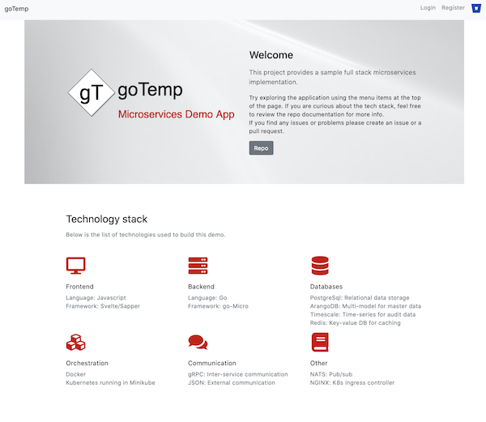
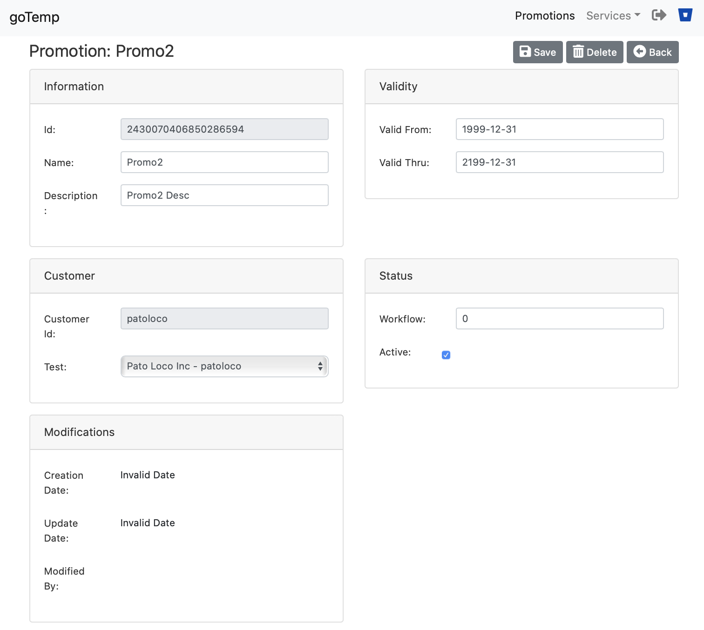
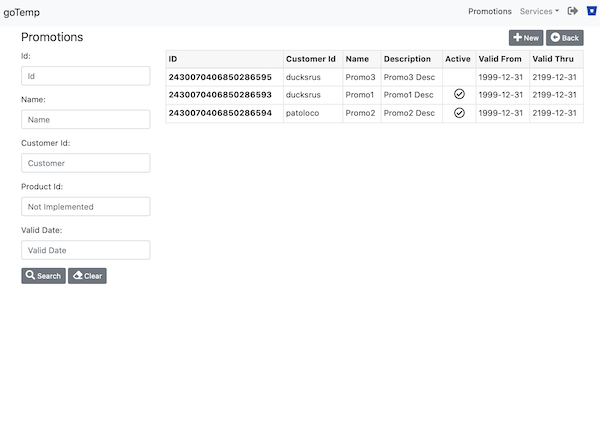

# Web Frontend


### Running

Run the frontend in development mode with:

```bash
npm run dev
```

Alternatively you can run the project using docker-compose from the goTemp root folder:
```bash   
docker-compose up web  
```
*Note*: Docker-compose also starts the micro api gateway when you start the frontend. 
If you do not want that to happen, you can remove the dependency in the docker-compose file at the goTemp root folder 

Which ever way you decide to start the frontend, you will also need to run at least the user service to be able to login.

Open up [localhost:3000](http://localhost:3000) and start clicking around.

##### Sample landing Page



##### Sample search Page



##### Sample detail sage

